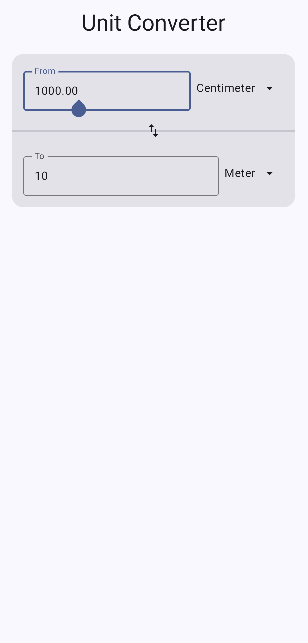
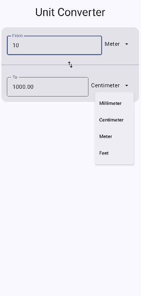

# Unit Converter App ⚙️

A simple Android app built with **Kotlin** and **Jetpack Compose** that allows users to convert **length units** in real time.

## ✨ Features
- Convert between length units:
    - Millimeter
    - Centimeter
    - Meter
    - Feet
- Bidirectional input (edit either field)
- Swap units instantly with a single tap
- Real-time conversion updates
- Clean and minimal UI using Jetpack Compose
- Fully offline — no internet required

## 🛠 Tech Stack
- Kotlin
- Jetpack Compose
- Material 3
- Android Studio

## 📸 Screenshots

## 🚀 What I Learned
- Building UI using Jetpack Compose
- State management with `remember`
- Handling bidirectional data flow
- Designing clean and user-friendly layouts
- Using Git and GitHub for version control

## 🤝 Contributing
Pull requests are welcome. Feel free to fork and improve the project.

---

~ [Nihar Patil](https://github.com/CodeHub0n)
